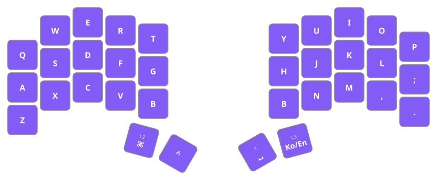
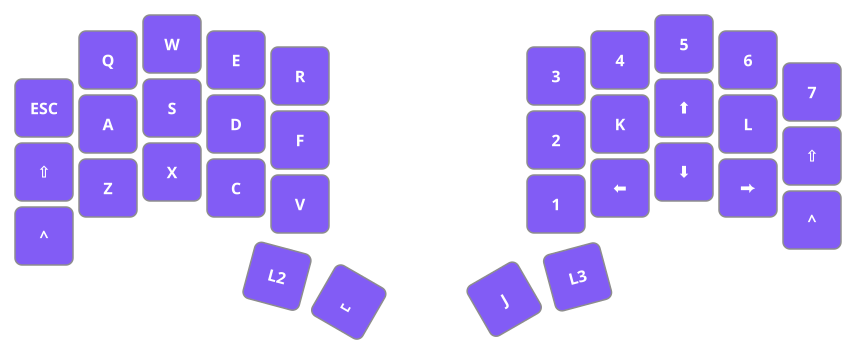
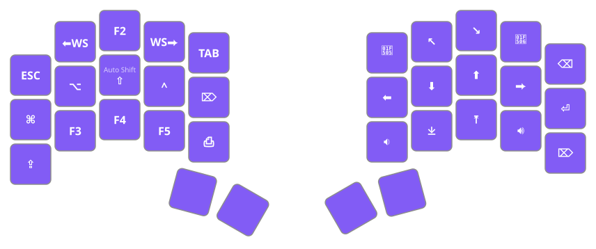
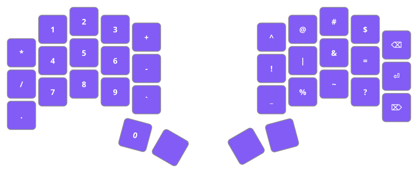

Firmware for: [Urchin Keyboard](https://github.com/duckyb/urchin)

## Getting started

**Are you trying to make your own ZMK firmware?**
[Here are the steps you need to take.](./GETTING_STARTED.md)

**Do you want to download my keymap?**

[Download the firmware zip from the latest action run.](https://github.com/moondg/urchin-zmk-firmware/actions) Check [the ZMK docs](https://zmk.dev/docs/user-setup#installing-the-firmware) for instructions on how to flash it.

## Keymap Design

### 0. Base

Most Koreans type `B` with their left hand, but type `ㅠ` (the Hangul character that shares same physical switch with `B`) with their right.
This is because 2-set Korean layouts use the left set for consonants and the right set for vowels.
Since `B` is usually positioned on the left side of a split keyboard, this creates a main problem.

There are generally two ways to solve this problem:

+ Type `ㅠ` with your left hand.
+ Add another `B` on the right.

I added another `B` on the right and removed the `/` and `?` keys.
Instead, I mapped `/` as a combo and moved `?` to the [Symbol](#symbol) layer.

Since `[]`, `{}`, `()`, `<>`, `/`, `\`, `'`, and `"` are used very frequently in coding, they must be accessed via combos on the Base layer.

### 1. Game

Collected keys for gaming: `Ctrl`, `Shift`, `Esc`, and WASD + alpha. `Space` is now on the left side, as usual.
The right side doesn't require much except arrow keys, so you can fill it with whatever you want.

### 2. Mod

The Mod layer holds frequently used modifier keys.

Following the Vim layout, `H`, `J`, `K`, `L` are mapped to arrow keys, and the corresponding left-hand home row keys are added so that `Ctrl`, `Shift`, and `Alt` can be combined with the right hand while it operates the arrow keys.
Similarly, `Home` and `End` are placed above `J`/`K` to allow combinations like `Shift+End`.
Since the right hand now handles direction and navigation, `PgUp` and `PgDn` are also placed on the right.
Combinations such as `Shift/Ctrl+Backspace/Enter/Delete` are used often, so `Backspace`, `Enter`, and `Delete` are included on the right as well.
The remaining empty spots are filled with volume and brightness keys.

The left side holds other frequently used keys.
It includes keys for switching workspaces left and right, along with `Esc`, `Tab`, `Delete`, and `PrtScr`, and the remaining empty spots are filled with function keys and `CapsLock`.
`Esc` is placed at the top-left corner because that is its traditional position.
`Tab` is not placed there instead, because that position is hard to combine with `Shift` or `Alt`.
Using `Tab` together with `Shift` or `Alt` requires it to be reachable by the index finger, so it is moved to the right side.
`Delete` is duplicated because the mouse is held with the right hand, and selecting or deleting files via `Shift/Ctrl+Click` should be handled entirely with the left hand.
Otherwise, the right hand would need to leave the mouse and move to the keyboard every time, wasting unnecessary movement.
Additionally, Auto Shift is implemented as a tap-hold and placed on the `Shift` key.

### 3. Symbol

The symbol layer holds numbers and special characters. There are two main options:

+ Assign `Shift` to the symbol layer and fill the rest with number and function keys. [Reference](https://keymapdb.com/keymaps/Lysquid/)
+ Don't assign `Shift` to the symbol layer, and fill it with numbers and special characters only.

I chose the second one, because I rarely use function keys, and pressing both the `MO(3)`(symbol layer key) and `Shift` together to type a special character is uncomfortable.

At this point, there are two more options:

+ Arrange the numbers like a numpad on one side and put the special characters on the other side.
+ Lay out the numbers horizontally and place each corresponding special character above its number.

I chose the first option, since I want `Backspace` and `Enter` to be available on the symbol layer as well, and to share muscle memory with the Mod layer.
In particular, I arranged the left side so it can be used as a standalone numpad, and placed the special characters on the right side to suit coding.

I plan to refine the special-character placement as I use it, but for now I placed the most frequently used characters on the home row, the next most frequent on the row above it, and the rest on the row below.

First, when typing combinations like `+=`, `-=`, `/=`, `%=`, `|=`, and `&=` in C/C++, using the same finger would be uncomfortable, so they need to be typed with two different fingers.
Since more than six such combinations already exist, the space available for placing the equals sign is limited.
On a normal keyboard, `=` sits in the rightmost column, so for the combinations above the typing order matches the layout order.
The only position that preserves this consistency while still allowing a different finger is the right ring finger.
Therefore, `=` goes on the ring finger.

Since most programming languages perform logical operations with `|` and `&`, I placed them on the home row.
`|` covers Haskell guards and ADTs and shell pipes, while `&` covers addresses and references in C/C++.
With the home row filled by logical operators, I placed `!` on the last home-row key.

Because `_` and `^` are used often in formulas in LaTeX and Markdown's KaTeX, I placed `^` on top and `_` below so they are easy to memorize.
The remaining keys are placed freely.
Since `%`, `~`, and `?` aren't used much in programming, they go on the bottom row.